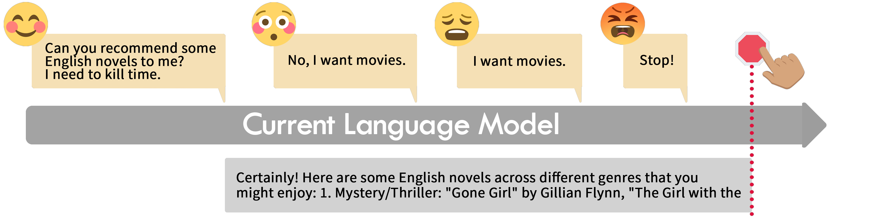
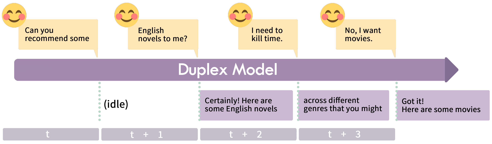

<div align="center">
  
  <br />
  <br />
  
  <br />
  <br />
  
# Beyond the Turn-Based Game: Duplex Models Enable Real-Time Conversations

<p align="center">
  <a href="./README.md">英文版</a> •
  <a href="https://arxiv.org/abs/2406.15718">论文</a> •
  <a href="https://huggingface.co/datasets/xinrongzhang2022/Duplex-UltraChat">数据</a> •
  <a href="https://huggingface.co/xinrongzhang2022/MiniCPM-duplex">模型</a>
</p>

</div>

## 简介
我们提出双工模型的概念，即一边接收用户输入一边生成输出，并可根据用户的及时反馈调整输出，如打断。不同于轮次对话机制，双工模型可以与用户实时交互。为展示双工模型的性能表现，我们基于MiniCPM-2.4B训练了一个实例模型，MiniCPM-duplex。双工模型的微调数据，不同于普通微调数据，每个输入输出被切成切片。

## MiniCPM-duplex试用
下面是将MiniCPM-duplex demo部署到本地Mac笔记本或者Linux服务器的步骤。

### 安装依赖
- 从官网https://nodejs.org/en/download/下载最新的node.js
- 解压文件，并把bin目录添加系统变量PATH
- 其他安装方式亦可
- 安装yarn, 运行`corepack enable`
- 安装Python依赖，运行`pip install -r requirements.txt`


### 加载模型

- 从🤗  Huggingface下载模型: <https://huggingface.co/xinrongzhang2022/MiniCPM-duplex>
- 将模型文件放在`./minicpm-duplex`路径下
- 启动后端服务
    ```
    python model_server_duplex.py
    ```
- 后端启动 `ws://localhost:8765`


### 运行demo服务

- 先确保后端已经启动
- demo自动连接到后端服务 `ws://localhost:8765`.
- 设置环境变量`DUPLEX_SERVER`可以修改后端地址.
- 运行demo服务
  ```
    yarn install
    yarn dev
   ```
- demo服务启动，http://localhost:3000

## 引用格式
```bibtex
@misc{zhang2024turnbasedgameenablingrealtime,
      title={Beyond the Turn-Based Game: Enabling Real-Time Conversations with Duplex Models}, 
      author={Xinrong Zhang and Yingfa Chen and Shengding Hu and Xu Han and Zihang Xu and Yuanwei Xu and Weilin Zhao and Maosong Sun and Zhiyuan Liu},
      year={2024},
      eprint={2406.15718},
      archivePrefix={arXiv},
      primaryClass={cs.CL}
      url={https://arxiv.org/abs/2406.15718}, 
}
```

## 致谢

Thanks to Xueheng Luo, Binhui Fan, Kaihuo Zhang, Ao Sun, Zhongwu Zhai, Yating Gong, Chaoqun He, Zhenning Dai, Yunqi Ba, Rongting Tang, Lei Zhang, Yingying Xiong, Tianmeng Pang, Chenzhe Jing, Ge Zhou, Siyuan Li, Yuge Tu, Yulin Chen, Ganqu Cui, Fengyuan Lu, Yudong Mei, Hanghao Wu, Suiyun Yang, Ran Yao, Ziming You, Jie Zhou, Jie Cai, Haifeng Xu, Yibin Li, Tianchi Cai, Xiang Long, Shi Yu, Renjie Lou, Yinxu Pan, JiaWen Liu, Hanqing Zhao, Peiqi Yu, Yishan Li, Bokai Xu, Yifan Luo, Siyuan Cai, Fuxi Zhu, Ran Yao, Tianyi Chen, Meixu Hu, Shi Yu, Ling Li, Zhenhua Zhang, Meiqi Fan, Yuqi Luo, Tianmeng Pang, Siyuan Liu, Bowen Ping.

## 参考
<ol>
<li>https://huggingface.co/openbmb/MiniCPM-2B-sft-bf16</li>
<li>https://github.com/thunlp/UltraChat</li>

</ol>